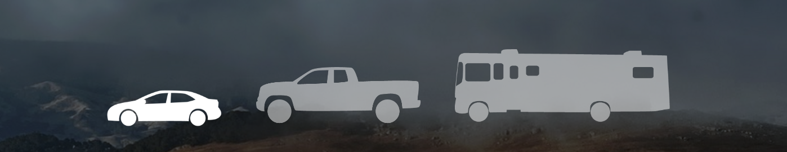

My app is called 'Road Trip Planner.' It is designed to help people plan ahead for their road trips by calculating how often they will need to stop for gas, as well as approximately how many minutes the stops will add to their overall driving time (assuming each stop is about 15 minutes long). 'Road Trip Planner' also takes into account that most people aren't filling up when their tank is completely empty, and so it calculates the amount of stops the user will make if they fill up when their gas tank is a quarter full.

As a bonus feature, the user can also calculate how many times they will need to stop for gas if they drive from planet to planet.

First and foremost I considered the simplicity and clarity of the design so that the user could navigate through the form efficiently. I understand that the average user does not have a high attention span and so I knew I needed to capture their attention quickly. The vehicle icons were added just in case the user did not know their vehicle's tank size. I designed the vehicle icons in Adobe Illustrator.

